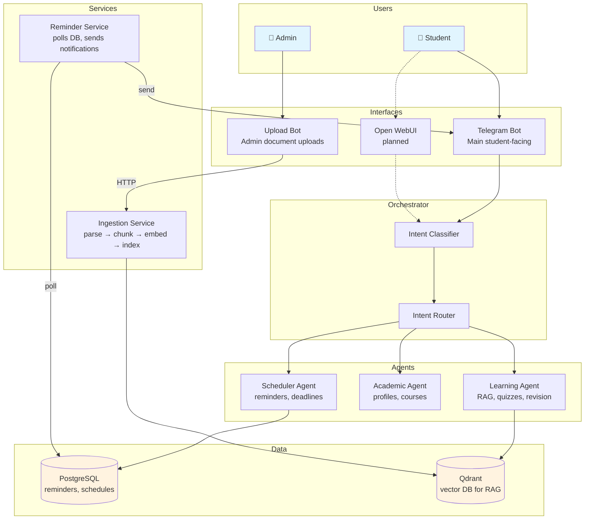

# BSTU-AI Architecture (High-Level)

## Quick Reference

| Component | Purpose |
|-----------|---------|
| **Telegram Bot** | Main entry point; receives messages → orchestrator → agents |
| **Intent Classifier** | Extracts intents from natural language |
| **Intent Router** | Routes to Learning / Academic / Scheduler agent |
| **Learning Agent** | RAG over BSTU materials, quizzes, revision plans |
| **Academic Agent** | Professor profiles, course requirements |
| **Scheduler Agent** | Create/edit/delete reminders, deadlines |
| **Reminder Service** | Background: polls Postgres for due reminders → Telegram |
| **Ingestion Service** | FastAPI: upload docs → parse → chunk → embed → Qdrant |
| **Upload Bot** | Admin-only: forwards files to Ingestion Service |
